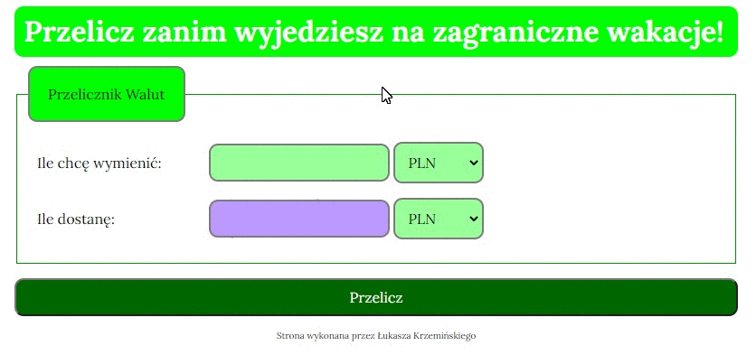

# Simple Currency Converter

## I've made a simple currency converter. It allows you to convert one currency into another.

### Description
The currency-converter is a simple page where I practiced JS Functions. You can chose one of the three available currencies and convert it into another one. For now the exchange rates are constants. The main goal was to practice how to build simple JS functions and reiterate what I've learned about building a simple layout using HTML and CSS. 

### How it works

1. Chose the amount of money u want to convert
2. Chose the currency u currently have
3. Chose the currency u want to get
4. Click the "Przelicz!" ("convert") button
5. In the violet window u can see the amount of money in chosen currency that you will get

### Preview

### Technologies Used

- HTML
- CSS
- JS

### Future work

 - adding an image as a background
 - upgrading exchange rates to use a real time exchange rate
 - *aaand thats everything I've come up for now :)*

### Author
Łukasz Krzemiński

### Contact
contact me at: [krzeminski.lukasz@interia.pl](krzeminski.lukasz@interia.pl)